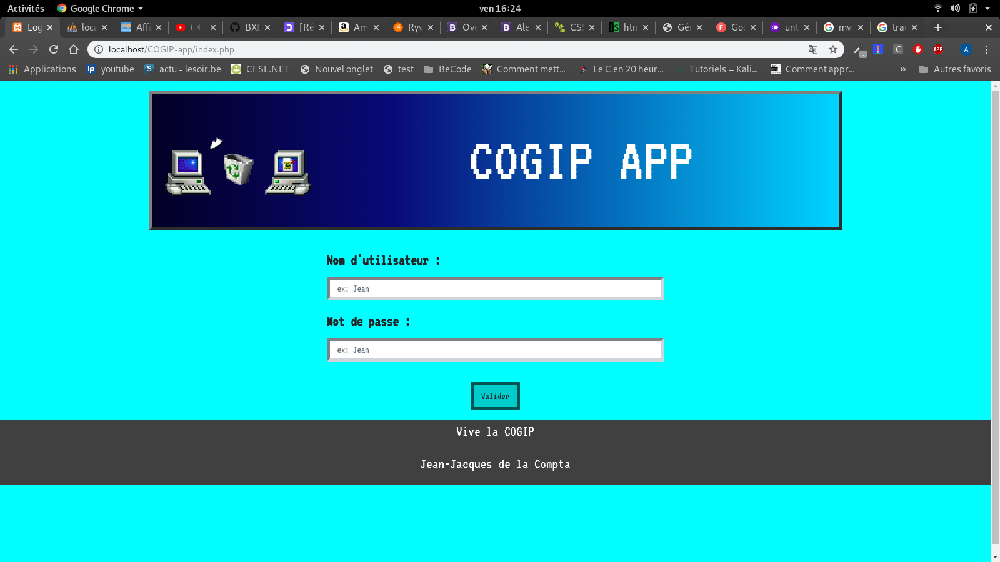

# Cogip exercise

### Goals:
* Train to work in group on a "long term project" of a fortnight
* Improve our PHP's skills
* Improve our SQL's skills
* Discover, understand and use the MVC method
* Learn how to deploy the website online
* Provide a secured website with admin or modo accesses

### Context:
* third training month
* First collaboration between the team members
* We knew nothing of MVC

### Langages and framework :
* HTML
* SASS and CSS
* Bootstrap
* PHP
* PHP myadmin
* MySQL
* MVC

### Website and GitHub :
#### Our Github's pages
* https://github.com/nassimkoceir
* https://github.com/arnaud-vanderschriek
* https://github.com/MatthieuDuranton/COGIP-app (code here)
#### Website
[Click here to access to the COGIP APP](http://nassimkoceir.be/cogip/)

### Specificities:
* Responsive website
* We had a lot of fun in designing the website following windows 95 aesthetic

### Planarization and feelings:
* We spent 2 to 3 days understanding MVC. We were glad to do so because the coding was then easier
* Nassim who was more at ease let his coworkers do as much as they could, helping to debug or to move forward before they felt discouraged. We were all glad he did so
* We were done in time despite some individuals constraints 

